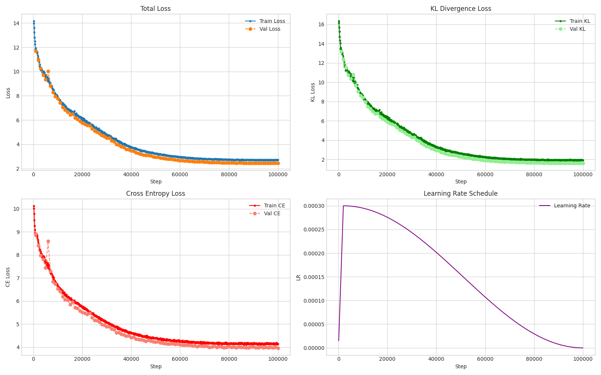
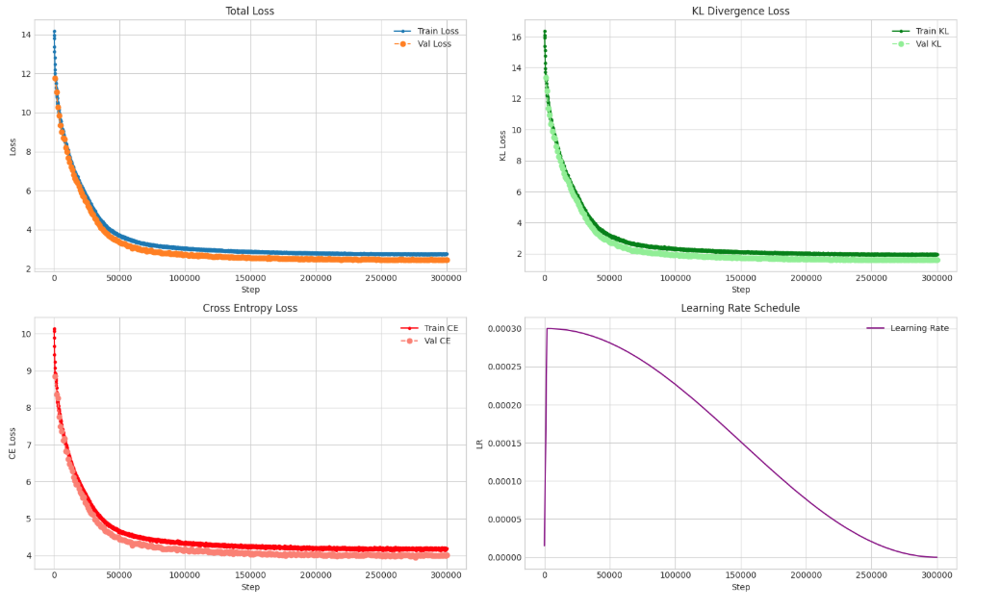

# Geneformer-Distilled

This is a part of our seminar at the Institute of Statistics at LMU Munich.

Here we are trying to distill 4M, 3M, & 2M parameter models from the 10M parameter Geneformer model, which is considered one of the seminal works in network biology. We have managed to compress the model from 10M to 4M (approx. 2.5x reduction) using around 1/25th of the data and 1/20th of the training budget, while maintaining reasonable performance.

## Resources & Checkpoints

All distilled models, checkpoints, and associated files are available on Hugging Face and GitHub.

- **Hugging Face**: [kkkamur07/geneformer-4.3M](https://huggingface.co/kkkamur07/geneformer-4.3M) Contains all the distilled models
- **GitHub**: This repository contains the full source code and configs.

## Project Structure

- **src/**: Contains all source code for the project (models, trainer, data loaders, etc.).
- **configs/**: Configuration files for Hydra. `config.yaml` contains all hyperparameters and paths.
- **mainData/**: Directory storage for datasets.
- **outputs/**: Contains training logs and saved checkpoints.
- **notebooks/**: Jupyter notebooks for experiments and visualizations.

> Each module has been documentation in the starting of the file. You can refer them to understand what is in the file. 

## How to Run

### 1. Data Preparation
The project relies on the **Genecorpus-30M** dataset.
1. Download the data from Hugging Face: [Genecorpus-30M](https://huggingface.co/datasets/ctheodoris/Genecorpus-30M).
2. Ensure your datasets are located in `mainData/` directory. The project expects Arrow format datasets.
3. To split the dataset into training and validation sets, run:

```bash
python -m src.data.split
```

### 2. Configuration
All experiment configurations are managed via Hydra in `configs/config.yaml`. You can modify model size, learning rates, batch sizes, and paths there.

### 3. Training
To start training the distillation process, use the `src.main` module.
For long running training sessions, it is recommended to use `nohup`:

```bash
nohup python -m src.main > training.log 2>&1 &
```
You can monitor the training progress by tailing the log file: `tail -f training.log` or checking the full run logs in `outputs/logs`.

### 4. Evaluation
To run quick evaluations on the trained models (Perplexity and MLM Accuracy): 

```bash
python3 -m src.evals.quick
```

*Note: You must manually update the `ckpt_path` variable in `src/evals/quick.py` to point to your specific checkpoint before running:*

```python
# In src/evals/quick.py & update the configs as well.
ckpt_path = "outputs/checkpoints/geneformer_distillation/model_best.pt"
``` 

## Outputs and Checkpoints

The training artifacts are saved in the `outputs/` directory. You can find checkpoints for the various model sizes here:

- **4.3M Parameters**: `outputs/checkpoints_/geneformer4.3M/`
- **3M Parameters**: `outputs/checkpoints_/geneformer3M/`
- **2M Parameters**: `outputs/checkpoints_/geneformer2M/`

## Results

Replicating the original study proved challenging but feasible. Below are the training metrics and comparisons for our distilled models.

### Metrics Reference
1. **Accuracy**: Masked Language Modeling (MLM) accuracy (higher is better).
2. **Perplexity**: Measure of model uncertainty (lower is better).

### 1. Geneformer 4.5M (Distilled)

 

Current numbers suggest the distillation is working. Training on more data improves accuracy, though with diminishing returns. Increasing training steps from 61k to 91k yielded a 2% MLM accuracy improvement and a 40% perplexity improvement.

```bash
============================================================
Metric          | Teacher (Target)   | Student (Yours)    | Gap       
MLM Accuracy    | 0.3059             | 0.2534             | -0.0524
Perplexity      | 15.40              | 22.48              | +7.08
============================================================
```

### 2. Geneformer 3M

Distilled with `hidden_size=96` (reduced from 128).

 

```bash
============================================================
Metric          | Teacher (Target)   | Student (Yours)    | Gap       
MLM Accuracy    | 0.3028             | 0.1864             | -0.1164
Perplexity      | 15.59              | 38.91              | +23.32
============================================================
```
*Note: The 3M model was trained for only 150,000 steps due to compute constraints, which explains the larger performance gap.*

### 3. Geneformer 2M

Distilled with `hidden_size=64` (reduced from 128).



```bash
============================================================
Metric          | Teacher (Target)   | Student (Yours)    | Gap       
MLM Accuracy    | 0.3049             | 0.1888             | -0.1161
Perplexity      | 15.77              | 40.30              | +24.52
============================================================
```

### Training Observations
- **Data Scaling**: Training on more data consistently improves MLM Accuracy and perplexity.
- **Double Descent**: We observed a phenomenon close to double descent around 150,000 steps, where convergence accelerated again.
- **Saturation**: Extending training from 300,000 to 600,000 steps resulted in only minor accuracy gains (~1%), suggesting capacity saturation for the smaller models.

## Challenges Replicating Geneformer

1. Even to download files from Hugging Face is a mess.
2. Needed to create a custom data collator due to variable length sampling $\to$ to save computing.
3. Due to variable sequence length failed to use `torch.compile()` which builds a dynamic CUDA graph. 
4. Compute challenges, the data is massive with around 27 Mn rows and 500 tokens per sequences.  
5. Data was pretokenized that helped but also it was the most important part of the paper, needed to build our own collator. 
6. General Clarity Needed on what is the BERT masking strategy. They used the default by they should have mentioned. 
7. The dataset for the V2 models are not being provided 104 M.
8. Working with a 27 Mn rows with 500 tokens amounts to 10B tokens approx, really difficult to work with it. Major optimizations in dataset.py.
9. Problem of the unavailability of the 104Mn rows dataset so we couldn't validate the V2 & V3 version of the experiment. 


## Further Work

1. **Hyperparameter Sweep**: We strongly recommend performing a hyperparameter sweep to further optimize the accuracy of the models. We were limited by compute resources and time, preventing an exhaustive search.
2. **Extended Training**: The 3M and 2M models show potential for improvement with more training steps, as they haven't yet reached the saturation point observed in the 4.3M model.
3. **Downstream Validation**: Implement evaluation on downstream tasks (e.g., Cell Type Classification) to ensure biological relevance is preserved during distillation.
